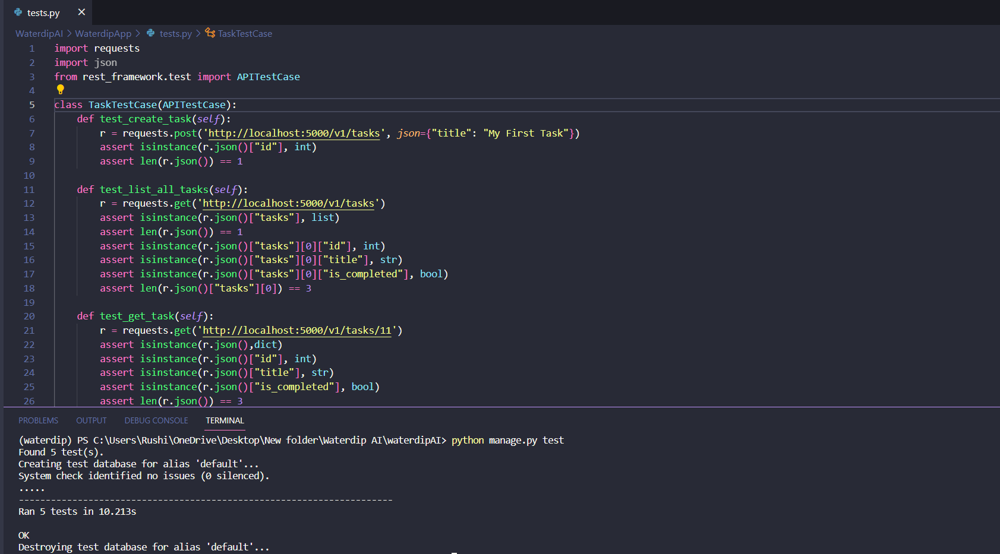

Waterdip AI Backend Assignment
========

This is Test Assignment submission for Back End Internship with Waterdip AI

Task
--------

- Building a server that can keep track of tasks.
- Create the necessary database structure and API’s for various task.

<details><summary>Test cases Image</summary>

--------

</details>

## How to run
```bash
# Fetch the repo using git
$ git clone https://github.com/Rushijaviya/WaterdipAI.git

# Go to the directory
$ cd WaterdipAI

# Install a compatible version
$ pip install -r requirements.txt

# Database Migrations
$ python manage.py makemigrations
$ python manage.py migrate

# To run server
$ python manage.py runserver

# To run test cases
$ python manage.py test
```

## API Details:
<details><summary>1. Create a new Task</summary>

    - URL: /v1/tasks
    - Request Type: POST
    - Input: {title: "Test Task 2"}
</details>

<details><summary>2. List all tasks</summary>

    - URL: /v1/tasks
    - Request Type: GET
    - Input: None
</details>

<details><summary>3. Get a specific task</summary>

    - URL: /v1/tasks/{id}
    - Request Type: GET
    - Input: id (passed through the URL)
</details>

<details><summary>4. Delete a specific task</summary>

    - URL: /v1/tasks/{id}
    - Request Type: DELETE 
    - Input: id (passed through the URL)
</details>

<details><summary>5. Edit the title or completion of a specific task</summary>

    - URL: /v1/tasks/{id}
    - Request Type: PUT
    - Input: {title: "Test Task 2", is_completed: false}
</details>

<details><summary>6. Bulk add tasks</summary>

    - URL: /v1/tasks
    - Request Type: POST
    - Input: {
        tasks: [
            {title: "Test Task 1", is_completed: true},
            {title: "Test Task 2", is_completed: false},
            {title: "Test Task 3", is_completed: true}
        ]
    }
</details>

<details><summary>7. Bulk delete tasks</summary>

    - URL: /v1/tasks
    - Request Type: DELETE
    - Input: {
        tasks: [
            {id: 1},
            {id: 2},
            {id: 3}
        ]
    }
</details>

Note:
--------
- No Front-end is made as goal is to develop APIs.